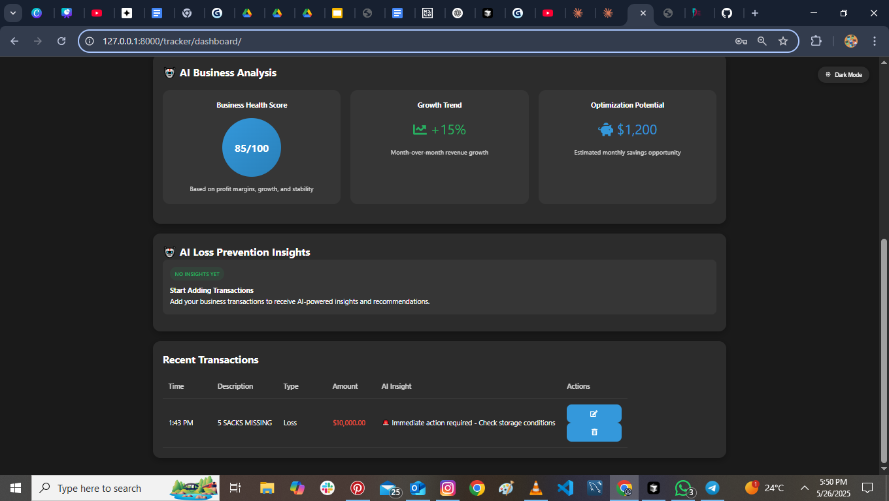
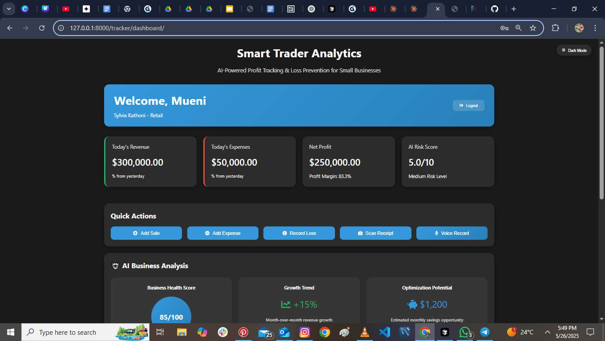
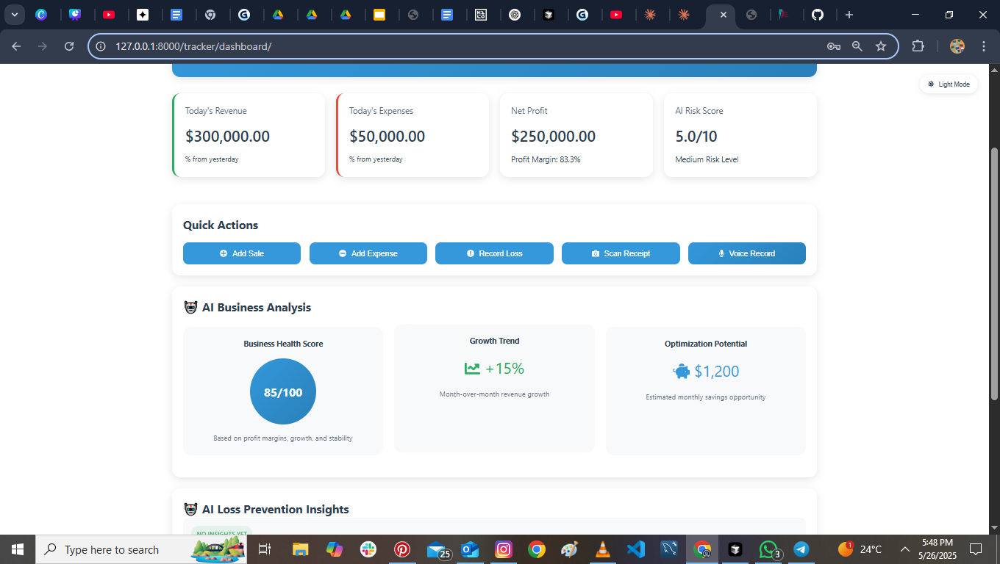
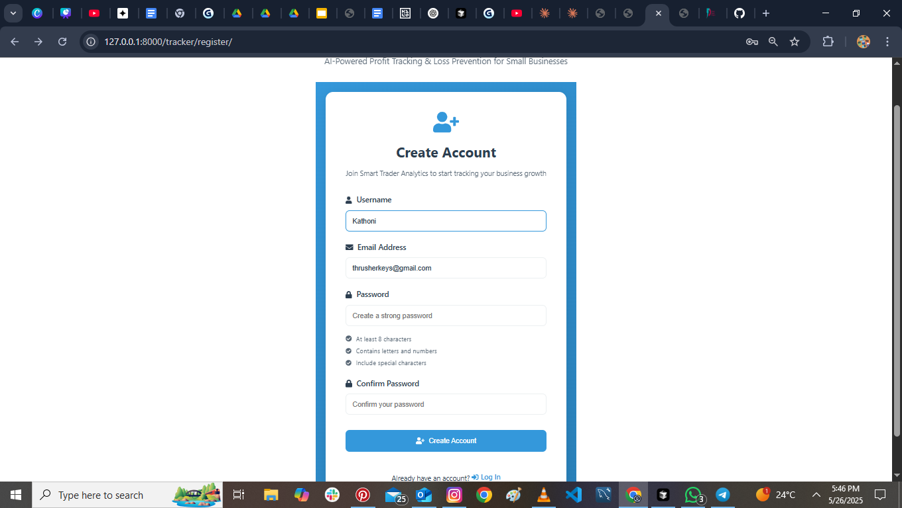
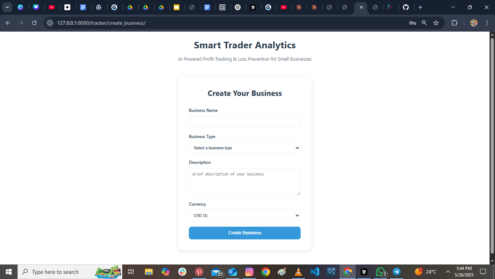

# Smart Trader Analytics

AI-Powered Profit Tracking & Loss Prevention for Small Businesses

## Features

### 1. Dashboard Overview

- Real-time financial metrics
- Today's revenue, expenses, and net profit tracking
- AI-powered risk assessment
- Dark/Light mode toggle
- User-friendly interface with business details

### 2. Quick Actions

- Add Sales
- Record Expenses
- Track Losses
- Scan Receipts
- Voice Recording feature

### 3. AI Business Analysis

- Business Health Score (85/100)
- Growth Trend Analysis (+15%)
- Optimization Potential ($1,200 monthly savings)
- Real-time AI insights

### 4. Secure Authentication

- User-friendly login interface
- Secure authentication
- Easy registration access

### 5. Business Setup

- Customizable business profile
- Multiple business types
- Currency selection
- Detailed business description

## Technical Features

- Real-time transaction updates
- AI-powered insights and recommendations
- Secure user authentication
- Responsive design for all devices
- Dark/Light theme support
- CSRF protection
- RESTful API architecture

## Security Features

- Secure password handling
- CSRF protection
- Protected API endpoints
- Secure session management
- Role-based access control

## Getting Started

1. Clone the repository
2. Install dependencies:
   ```bash
   pip install -r requirements.txt
   ```
3. Set up your database:
   ```bash
   python manage.py migrate
   ```
4. Create a superuser:
   ```bash
   python manage.py createsuperuser
   ```
5. Run the development server:
   ```bash
   python manage.py runserver
   ```

## Technologies Used

- Django (Backend Framework)
- SQLite (Database)
- HTML5/CSS3
- JavaScript (Frontend Interactivity)
- Font Awesome (Icons)
- REST Framework (API)
- AI/ML for Business Analytics

## Contributing

Contributions are welcome! Please feel free to submit a Pull Request.

## License

This project is licensed under the MIT License - see the LICENSE file for details.

## Support

For support, email thrusherkeys@gmail.com or open an issue in the repository. 
